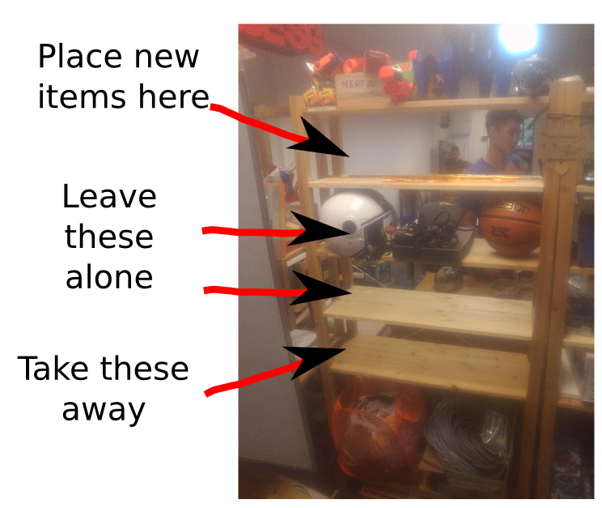
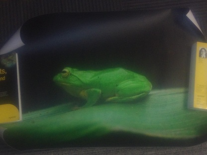
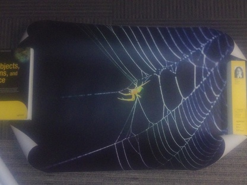
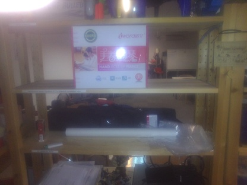
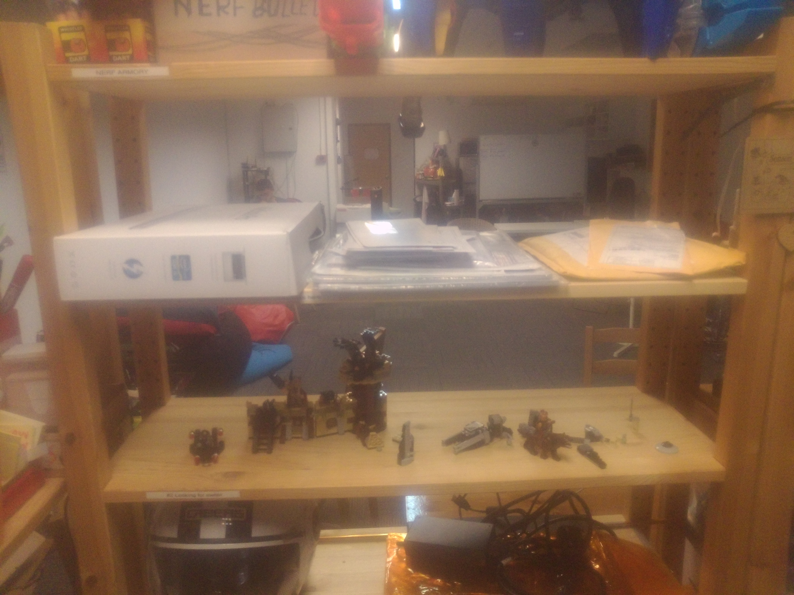
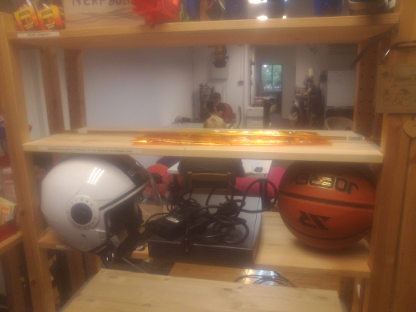

# Dealing with Old Hardware

HackerspaceSG uses the [Old Hardware Pattern](http://hackerspaces.org/wiki/The_Old_Hardware_Pattern) to help prevent it from turning into a museum full of junk.

The old hardware pile is four shelves just inside the front door, for use as follows:

## #1 Put disposal candidates here

If you feel that a particular object in the space is taking up space and should be discarded but are concerned that it might not be appropriate to simply bin it (e.g. because it may valuable to someone) then simply place it here.

About once a week the old hardware pile maintainer (currently [Roland](http://rolandturner.com/)) will move items in this shelf to shelf #2 and post a notice to the [mailing list](https://groups.google.com/forum/#!forum/hackerspacesg) describing the items.

## #2 Looking for owner

Items on this shelf are being held temporarily to give time for owners to discover that their item is being ejected and to claim it.

- If you own an item on this shelf then feel free to remove that item from the space. Please post a note to the mailing list indicating that you've done so.
- In all other cases, please leave items on this shelf untouched. Please don't add items to this shelf.

About once a week, the maintainer will move items on this shelf to shelf #3.

## #3 Looking for owner

(As for shelf #2, except that the weekly move will instead be to shelf #4.)

## #4 Free to take or freecycle

Items on this shelf have been announced as pending discard for at least two weeks without having been recovered by the owner. At this point, anyone can take them, **so long as they are removed from the space**.

Items on this shelf may also be offered for Freecycling.

About once a week the maintainer will discard items on this shelf.

# Items Placed in the Pile

## 2014-05-03

- iword hand roll up piano
- Singapore Geek Girls banner and stand
- assorted plastic bags
- cigarettes and lighters
- frog poster
- spider poster

## 2014-04-26

- Assorted Lego
- 13.3" Macbook Pro A1278, in box
- Operation Instruction for "A380" remote control plane
- Unclaimed mail
	- Loong Jin Chow (1 package)
	- Fazli Mansor (1 package)
	- AMS Associates Pte Ltd
	- Harvest Global Investments Pte Ltd (2)
	- Launchpad Technologies Pte Ltd (3)
	- New Geok Kim / Kim New (4) (I suspect this is the previous tennant)
	- Ubiquinix Systems Pte Ltd
	- Wee Hur Holidings Ltd.
	- Sim Lye Huat (5)
	- W. Ling Gwen / Aimpact Consultancy (2)

## 2014-04-18

- Yellow film left over from making the coloured display on the front windows of the space
- Riviera Caberg helmet
- Cisco 881 switch
- Basketball
